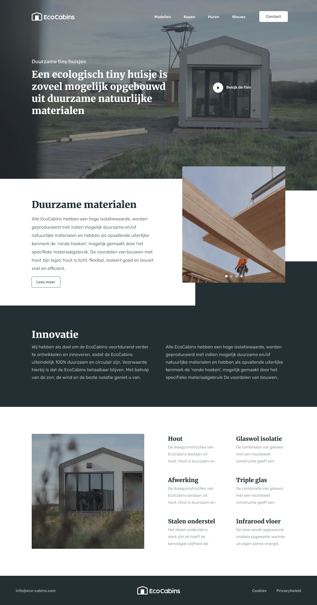

# EcoCabins Landing Page

This is a solution to the simple landing page challenge. 

## The challenge

My task was to create a page, which would be adaptive and which would look similar to a given figma file. 

### Links

- Live Site URL: (https://eloquent-monstera-9a382b.netlify.app/)

### Built with

- Semantic HTML5 markup
- SCSS 
- Flexbox
- Grid
- Adaptive layout
- Vanilla JavaScript

### What I learned

I have learned how to add slider using swiper.js. Also I have learned more about attribute selectors and how useful they can be. I continue working with Sass, discovering it's pros. 

### Screenshot

This is a screenshot of a given Figma file.

